# Bikesharing, Module 14 Challenge

Now that we've gotten a good idea of how to create our story, there is still some more work to be done to convince investors that a bike-sharing program in Des Moines is a solid business proposal. To solidify the proposal, one of the key stakeholders would like to see a bike trip analysis.
For this analysis, you’ll use Pandas to change the "tripduration" column from an integer to a datetime datatype. Then, using the converted datatype, you’ll create a set of visualizations to:
Show the length of time that bikes are checked out for all riders and genders
Show the number of bike trips for all riders and genders for each hour of each day of the week
Show the number of bike trips for each type of user and gender for each day of the week.
Finally, you’ll add these new visualizations to the two you created in this module for your final presentation and analysis to pitch to investors.

## Deliverable 1

The data in the "tripduration" column is converted to a datetime datatype and has the correct time format.

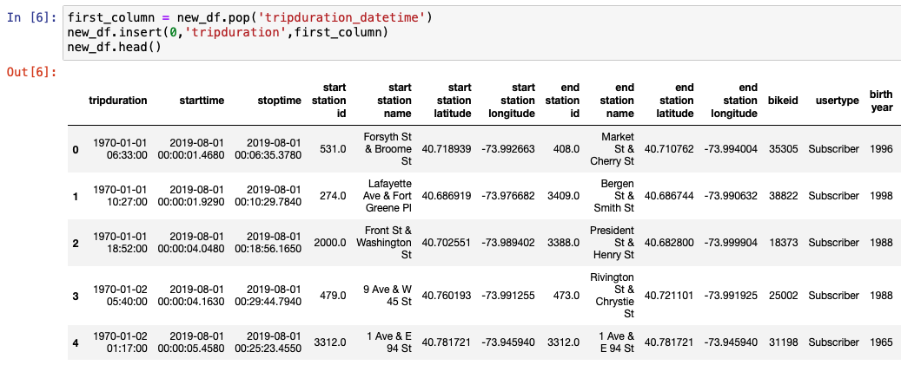

The DataFrame is exported as a new **".csv"** file, without the index column.

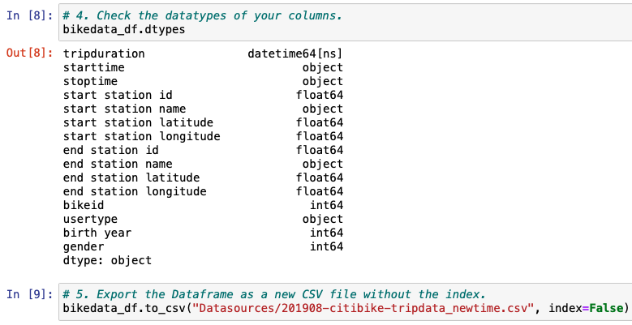

## Deliverable 2

A line graph displays the number of bikes checked out, by trip duration, for all users. The graph can be filtered by its duration, in hours.

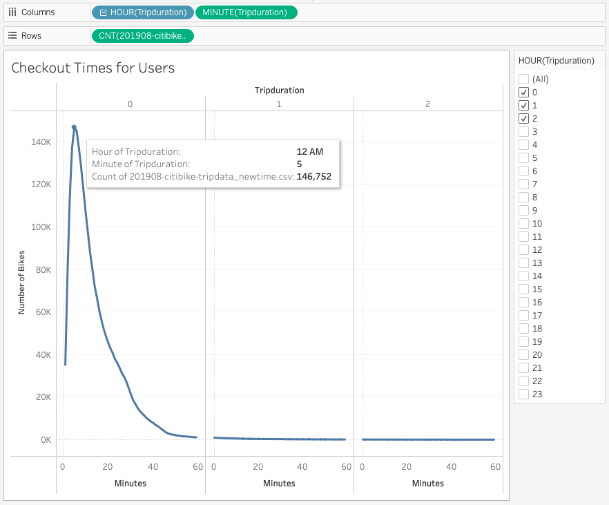

A line graph displays the number of bikes that are checked out by duration for each gender, by the hour. The graph can be filtered by the hour and gender.

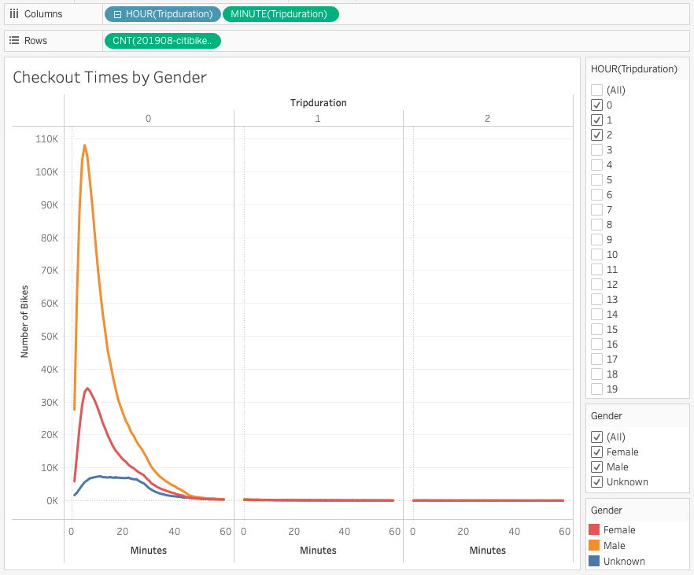

A heatmap shows the number of bike trips for each hour of each day of the week.

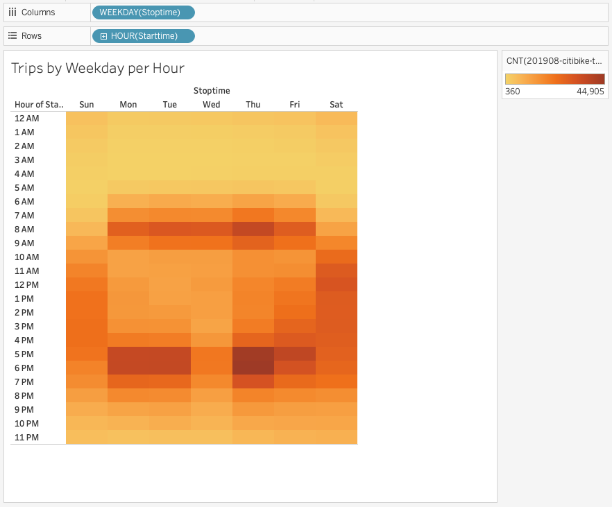

A heatmap shows the number of bike trips by gender for each hour of each day of the week, the heatmap can be filtered by gender.

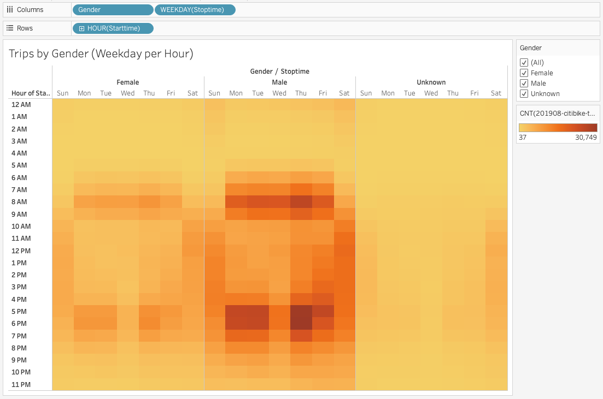

A heatmap shows the number of bike trips for each type of user and gender, for each day of the week, it can be filtered by user and gender.

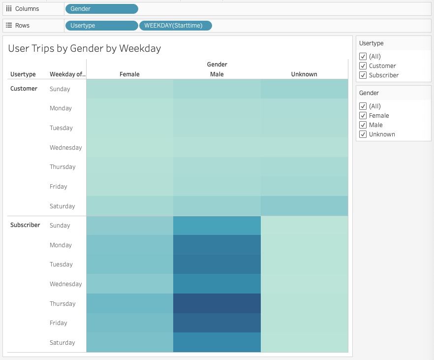

## Deliverable 3

You will earn a perfect score for Deliverable 3 by completing all requirements below:
Structure, Organization, and Formatting (6 points)

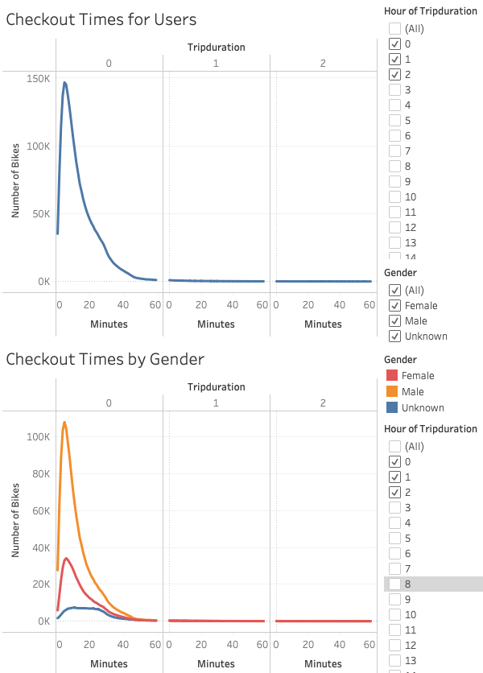

The written analysis has the following structure, organization, and formatting:
There is a title, and there are multiple sections. (2 pt)

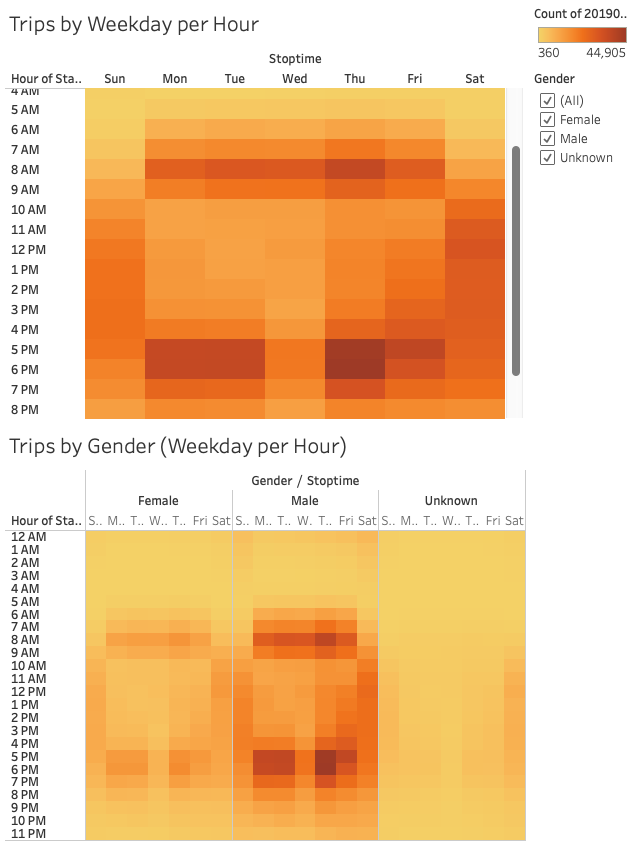

Each section has a heading and subheading. (2 pt)

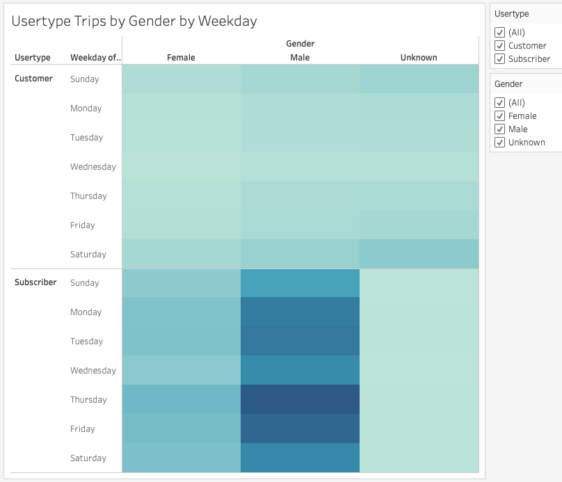

Links to images are working and displayed correctly. (2 pt)

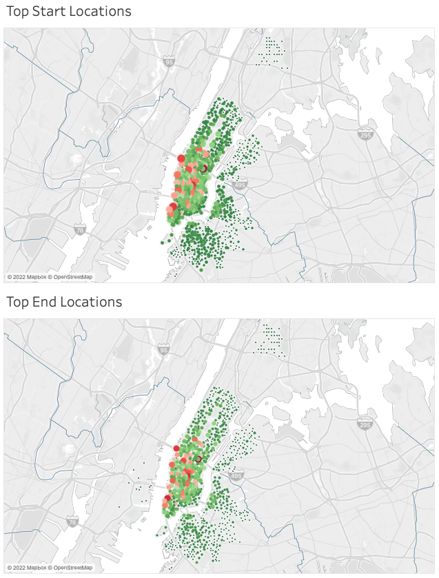

Analysis (24 points)

The written analysis has the following:
Overview of the statistical analysis:
The purpose of the analysis is well defined. (5 pt)

### Results

There are at least seven visualizations for the NYC Citibike analysis (7 pt)

There is a description of the results for each visualization (7 pt)

Summary:
There is a high-level summary of the results and two additional visualizations are suggested for future analysis (5 pt)

