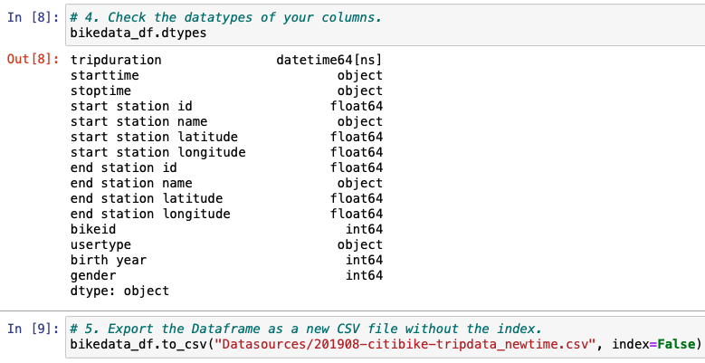

# Bikesharing, Module 14 Challenge

"Bikesharing" analyzes New York City's Bikesharing data, to assess if this business model could be replicated in Des Moines. The rides are sorted and filtered by duration, hour, day, gender, user-type, start and end-locations.

[Link to Public Tableau](https://public.tableau.com/app/profile/luis.salazar6790/viz/Mod14Challenge_16512468881840/BikesharingSummary?publish=yes)

## Deliverable 1

The data in the "tripduration" column is converted to a datetime datatype and has the correct time format.

The DataFrame is exported as a new **".csv"** file, without the index column.

## Deliverable 2

A line graph displays the number of bikes checked out, by trip duration, for all users. The graph can be filtered by its duration, in hours.

A line graph displays the number of bikes that are checked out by duration for each gender, by the hour. The graph can be filtered by the hour and gender.

A heatmap shows the number of bike trips for each hour of each day of the week.

A heatmap shows the number of bike trips by gender for each hour of each day of the week, the heatmap can be filtered by gender.

A heatmap shows the number of bike trips for each type of user and gender, for each day of the week, it can be filtered by user and gender.

## Deliverable 3

**3.1 Analysis**

The purpose of analyzing New York City's Bikesharing data, is to make some correlations, and decide if this business model could be replicated in Des Moines.

The following parameters will be examined in detail:

* The length of time that bikes are checked out for all riders and genders
* The number of bike trips for all riders and genders for each hour of each day of the week
* The number of bike trips for each type of user and gender for each day of the week

**3.2 Results**

3.2.1 Trip Duration

The following figure shows that most of the trips have a duration of 6 minutes, this will roughly be a 1 mile ride.

Male users outweigh female and unknown riders, in a 3/1 ratio.

3.2.2 Usage by Day/Hour and Gender

The highest usage happens on weekdays: 5 PM to 7 PM, and 8 AM to 9 AM, followed by Saturdays from 11 AM to 4 PM. The lowest usage is on Tuesday at 3 AM, with just 360 rides, compared to the highest usage of 44,905 rides on Thursdays at 6 PM.

As discussed in 3.2.1, male users continue to dominate in each category, following the same pattern and ratio.

3.2.3 Usage: Subscribers vs Customers

The ratio of subscribers to customers is around 4 to 1.

3.2.4 Additional: Start and End Locations

The next figure highlights that both starting and ending locations are concentrated (around 6-minute, or one mile rides) at the south of Times Square.

**3.3 Summary**

Based on the analysis done, the following observations can be drawn:

* Almost all the rides are under 30 minutes, peaking at 6 minutes
* Male users represent around 75% of total riders
* The peak hours are 5 PM, 8 AM, and all Saturday afternoon
* The subscribers represent around 80% of riders
* Both start and end locations are predominantly located in south Manhattan area (high occupancy offices and touristic attractions)

For a successful implementation of a bikesharing business, the following points have to be reviewed and evaluated in Des Moines:

* Availability, length and connectivity of bicycle-friendly roads
* Location of major bus stops
* Location of landmarks to attract tourists
* Location of office buildings to get subscribers as recurrent users

Other potential users:

* Small businesses could use bike rides for easy delivery